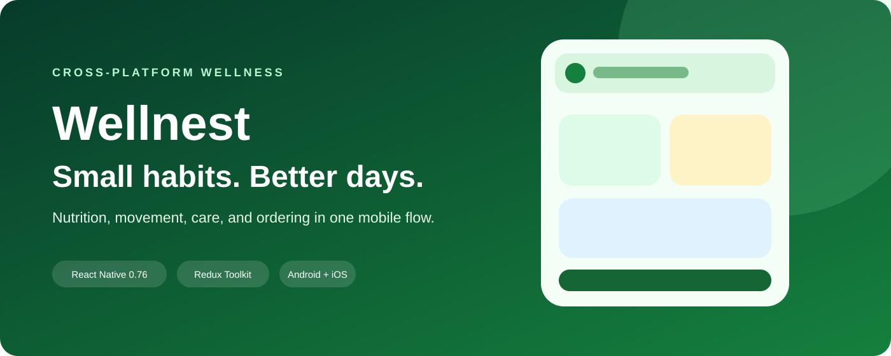
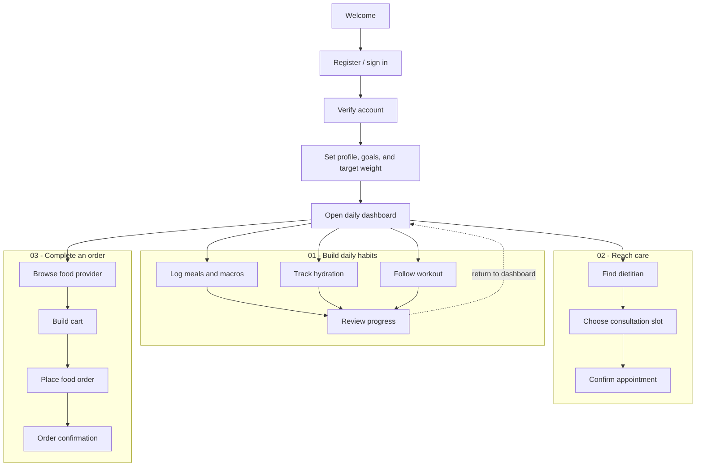

# Wellnest

> A cross-platform wellness companion for nutrition, fitness, hydration, consultations, and food ordering.

## Overview

Wellnest brings daily wellness actions into one mobile experience. Users complete onboarding and health goals, track meals and hydration, review calorie and macro information, follow workouts, manage target weight, search dietitians, book online consultations, and order food. Separate dietitian and food-provider workspaces support the operational side of the product.

## My contribution

- React Native navigation architecture with auth, onboarding, bottom tabs, and role-specific stacks
- Login, registration, OTP verification, Google sign-in, profile setup, fitness goals, BMI, and target weight journeys
- Food diary, meal records, calorie/macronutrient inputs, meal-type workflows, and image uploads
- Hydration tracking, workout/video screens, progress states, and date/calendar interactions
- Dietitian discovery, online consultation booking, appointment views, and practitioner meal management
- Food-provider catalog, product detail, cart, “for myself / for someone” ordering, and confirmation flows
- API integration, AsyncStorage persistence, Redux Toolkit state, charts, pickers, permissions, and media handling

## Skills demonstrated

| Area | Applied |
| --- | --- |
| Mobile engineering | React Native screens, native stack/bottom tabs, safe areas, reusable controls |
| Wellness UX | Goals, BMI, weight, meals, hydration, workouts, progress, and daily habits |
| Marketplace flows | Dietitian search, consultation booking, food catalog, cart, and order confirmation |
| Role-based product | User, dietitian, and food-provider experiences with dedicated workflows |
| State and data | Redux Toolkit, AsyncStorage, API requests, upload payloads, and local session state |
| Device integration | Google sign-in, date/time pickers, camera/gallery selection, health/fitness bridges, and permissions |

## Wellness operating flow

Wellnest turns onboarding data into a repeatable daily loop: define a goal, complete small wellness actions, review progress, and reach the right practitioner or food provider when support is needed.

**Outcome:** a measurable wellness routine with connected practitioner and food-service workflows.

## Technical stack

React Native 0.76 · React Navigation 7 · Redux Toolkit · AsyncStorage · Axios · React Native Paper · Gifted Charts · Calendars · Google Sign-In · Native permissions and media modules.

See [architecture](docs/ARCHITECTURE.md), [user flows](docs/USER-FLOWS.md), [security policy](SECURITY.md), [screenshot guide](docs/SCREENSHOT-GUIDE.md), and [GitHub setup](docs/GITHUB-SETUP.md).
"# wellnest" 
