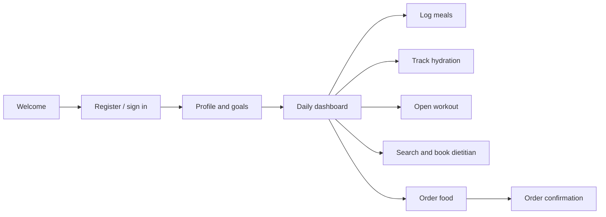

# User flows

## Practitioner flow

Dietitians can review appointments, maintain food items, add nutrition values, and review food history. Food providers maintain their business profile and product data so the customer experience stays connected to the operational workflow.
